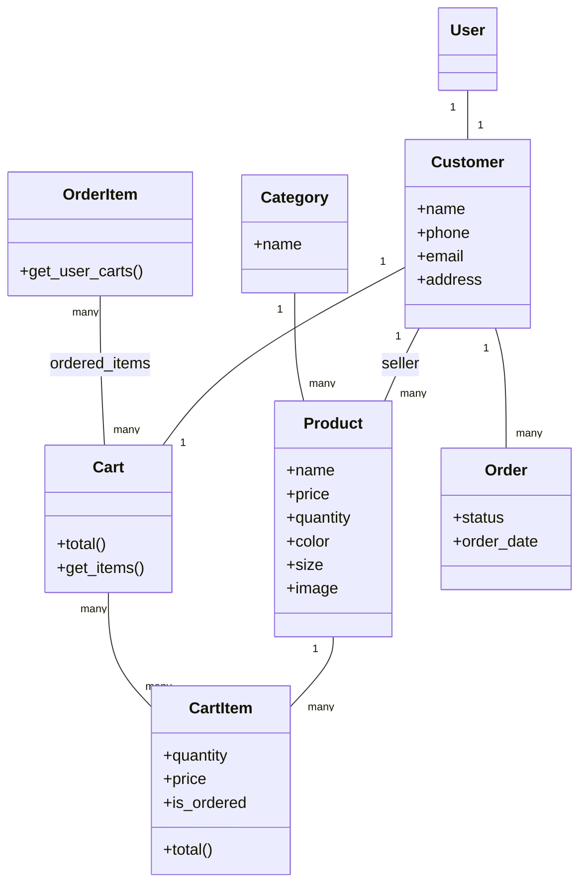

# ShopSpot

ShopSpot is an Amazon-style e-commerce platform built with Django REST Framework on the backend and React.js on the frontend. It lets users browse and filter products by category and price, manage a shopping cart, place and track orders, and leave product reviews, with token-based authentication for customer accounts. The backend is organized into two Django apps: `profiles` (customer accounts/auth) and `categories` (products, cart, and orders).


## Features

- Customer accounts backed by Django's `User` model, extended with a `Customer` profile (name, phone, email, address)
- Product catalog with `Category` and `Product` models (price, quantity, color, size, image URL, seller)
- Shopping cart: `CartItem` auto-calculates its price from product price × quantity and validates against available stock; `Cart` aggregates a customer's items and computes a running total
- Order flow: `Order` tracks status (pending, shipped, delivered, canceled) per customer; `OrderItem` links carts into a placed order
- Product filtering by category and price (`categories/filters.py`, `django-filter`)
- REST API exposed via DRF `ViewSet`s and a `DefaultRouter` for Products, Cart, CartItems, Category, Order, and OrderItems
- Token-based login/logout endpoints for authentication
- Management commands to generate fake product data (`generate_fake_products`) and bulk-delete products (`delete_products`), useful for seeding a dev database
- PayPal integration dependency (`django-paypal`) present for payment processing
- Unit tests for models, URLs, and views in both the `categories` and `profiles` apps

## Tech Stack

- **Backend:** Django 5.0, Django REST Framework, `django-filter`, `django-cors-headers`, `django-paypal`
- **Database:** MySQL (`mysqlclient`) in production-style config, SQLite (`db.sqlite3`) present for local development
- **Frontend:** React.js
- **Testing:** `pytest`
- **Other:** `Faker` (test data generation), `Pillow` (image handling)

## Project Structure

- `djangoProject/` — Django project settings, root URL config, WSGI/ASGI entry points
- `profiles/` — customer accounts: `Customer` model, serializers, views (`viewset_customer`, `login`, `logout`), URLs
- `categories/` — core commerce app: `Category`, `Product`, `CartItem`, `Cart`, `Order`, `OrderItem` models; serializers, filters, viewsets, and URLs
- `categories/management/commands/` — custom Django management commands for seeding/cleaning product data
- `categories/tests/`, `profiles/tests/`, `Test/` — model, URL, and view test suites
- `API-Documntation.md` — API endpoint documentation
- `manage.py` — Django management entry point
- `requirements.txt` — Python dependencies

## Architecture

Core e-commerce data model and relationships:



REST API surface (via DRF routers):

- `/Categories/Products/`, `/Categories/cart_items/`, `/Categories/cart/`, `/Categories/category/`, `/Categories/order_item/`, `/Categories/order/`
- `/profile/customer/`, `/profile/login/`, `/profile/logout/`

## Installation

```bash
git clone https://github.com/OmarElzero/ShopSpot.git
cd ShopSpot
python -m venv venv
source venv/bin/activate      # venv\Scripts\activate on Windows
pip install -r requirements.txt
```

Configure environment variables (database credentials, etc.) as needed, then apply migrations:

```bash
python manage.py migrate
python manage.py createsuperuser   # optional
python manage.py runserver
```

Frontend (React):

```bash
cd frontend   # if a separate frontend directory is present
npm install
npm start
```

## Usage

Once the server is running, the REST API is available at `http://127.0.0.1:8000/Categories/...` and `http://127.0.0.1:8000/profile/...`. Seed sample products for testing:

```bash
python manage.py generate_fake_products
```

Refer to `API-Documntation.md` in the repository for the full list of endpoints and expected payloads.

## Demo

No live demo is available for this project.

## Testing

```bash
pytest
```

Test suites cover models, URLs, and views for both the `categories` and `profiles` apps (`categories/tests/`, `profiles/tests/`, `Test/`).

---

**Author:** OmarElzero · [GitHub](https://github.com/OmarElzero)
_Last updated: 2026-08-23_
